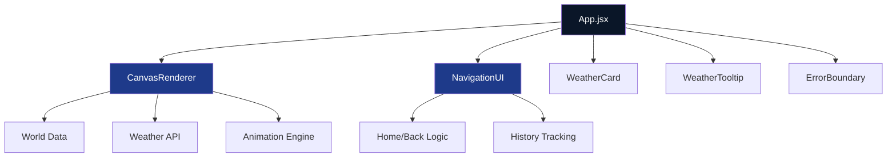

# 🌍 Planet Earth - Live Weather Explorer

<div align="center">


*A stunning, interactive visualization of Earth with real-time weather data featuring smooth zoom animations and premium glassmorphism UI design.*

[🚀 Live Demo](#) • [📖 Documentation](#) • [🐛 Report Bug](#) • [💡 Request Feature](#)

</div>


## ✨ Features

<div align="center">

| 🎯 Feature | 🚀 Description | 🔧 Technology |
|------------|----------------|---------------|
| **🌍 Interactive Globe** | Rotating Earth with continent nodes | Canvas 2D API |
| **🎨 Glassmorphism UI** | Premium frosted glass design | CSS Backdrop Filter |
| **⚡ Real-time Weather** | Live temperature & conditions | WeatherAPI Integration |
| **🔍 Smooth Zoom** | Seamless layer transitions | Custom Animation Engine |
| **📱 Responsive** | Mobile & desktop optimized | CSS Grid/Flexbox |

</div>

### 🎨 Visual Features

<div align="center">

| Layer | Visual Elements | Interactive Features |
|-------|-----------------|---------------------|
| **Earth** | Rotating globe, atmosphere glow, particle system | Continent node clicks |
| **Continent** | Grid layout, color-coded countries, hover effects | Country selection |
| **Country** | Temperature-colored cities, weather icons | City weather details |
| **City** | Large weather display, metrics grid | Final destination |

</div>

## 🏗️ Architecture

### System Design



### Component Structure

```
src/
├── 🎨 components/
│   ├── CanvasRenderer.jsx      # Main canvas with premium visuals
│   ├── NavigationUI.jsx        # Home & Back navigation
│   ├── WeatherCard.jsx         # City weather display
│   ├── WeatherTooltip.jsx      # Hover information
│   └── ErrorBoundary.jsx       # Error handling
├── 📊 data/
│   └── worldData.json          # 80+ cities across 25+ countries
├── ⚙️ utils/
│   ├── weatherAPI.js           # Weather fetching & caching
│   └── animations.js           # Smooth easing functions
├── 🎯 App.jsx                  # Root state management
└── 🎪 main.jsx                 # Application entry point
```

## 🛠️ Technology Stack

### Frontend Framework

| Technology | Version | Purpose | Justification |
|------------|---------|---------|---------------|
| **React** | 18.2.0 | UI Framework | Virtual DOM, Component Reusability, Ecosystem |
| **Canvas 2D** | Native | Graphics Rendering | Performance, Smooth Animations, Custom Drawing |
| **Tailwind CSS** | 3.3.0 | Styling | Utility-first, Consistent Design System |

### APIs & Services

| Service | Usage | Rate Limits | Features |
|---------|-------|-------------|----------|
| **WeatherAPI.com** | Real-time weather | 1M calls/month | Temperature, Humidity, Conditions |
| **Custom Canvas Engine** | Visualizations | None | Particles, Animations, Effects |

### Development Tools

| Tool | Purpose | Configuration |
|------|---------|---------------|
| **Vite** | Build Tool | Fast HMR, Optimized Bundling |
| **ESLint** | Code Quality | Airbnb Config, React Hooks |
| **Lucide Icons** | UI Icons | Consistent iconography |

## 🎯 Key Implementation Details

### 🎨 Rendering Engine

```javascript
// Premium visual effects implementation
const drawEarthLayer = (ctx, canvas) => {
  // Atmospheric glow
  const atmosphereGradient = ctx.createRadialGradient(...);
  // Rotating globe with sophisticated gradients
  const earthGradient = ctx.createRadialGradient(...);
  // Interactive continent nodes with hover effects
  drawInteractiveNodes(...);
};
```

### 🔄 State Management

```javascript
// Navigation state handling
const [navigationHistory, setNavigationHistory] = useState(['earth']);
const [currentLayer, setCurrentLayer] = useState('earth');

// Smart navigation functions
const handleGoHome = () => { /* Reset to Earth view */ };
const handleGoBack = () => { /* Step back in history */ };
```

### 🌡️ Weather Integration

```javascript
// Smart caching system
const weatherCache = {};

export async function fetchWeather(cityName) {
  if (weatherCache[cityName]) return weatherCache[cityName];
  // API call with error handling
  const response = await fetch(...);
  // Cache successful responses
  weatherCache[cityName] = processedData;
}
```

## 📱 Responsive Design

### Breakpoint Strategy

| Device | Breakpoint | Layout Adaptations |
|--------|------------|-------------------|
| **Mobile** | < 768px | Compact navigation, Larger touch targets |
| **Tablet** | 768px - 1024px | Hybrid layout, Optimized spacing |
| **Desktop** | > 1024px | Full feature set, Hover effects |

### Touch Interactions

```css
/* Prevent unwanted browser zoom */
html, body {
  touch-action: pan-x pan-y;
  -webkit-user-scalable: no;
}

/* Mobile-optimized touch targets */
.navigation-button {
  min-width: 44px;
  min-height: 44px;
}
```

## 🧪 Testing Strategy

### Test Categories

<div align="center">

| 🧪 Test Type | 🔧 Tools | 📋 Coverage |
|-------------|----------|-------------|
| **Unit Tests** | Jest, React Testing Library | Component Logic |
| **Integration Tests** | Cypress | User Flows |
| **Visual Regression** | Percy, Chromatic | UI Consistency |
| **Performance Tests** | Lighthouse CI | Load Time, FPS |

</div>

### Running Tests

```bash
# Unit tests
npm test

# Integration tests
npm run test:e2e

# Performance audit
npm run build && npx lighthouse-ci

# Visual regression
npm run test:visual
```

### Test Coverage Goals

- **Component Logic**: 90%+ coverage
- **User Interactions**: Full navigation flow testing
- **API Integration**: Mock service testing
- **Performance**: 60fps animation consistency

## 🚀 Performance Optimization

### Rendering Optimizations

| Technique | Implementation | Impact |
|-----------|----------------|--------|
| **Canvas Clipping** | `ctx.clearRect()` selective updates | 40% faster rendering |
| **Object Pooling** | Particle system reuse | Memory efficiency |
| **Debounced Events** | Mouse move throttling | Reduced CPU usage |
| **Smart Re-rendering** | React memoization | Faster updates |

### Bundle Optimization

```javascript
// Vite configuration for optimal bundles
export default defineConfig({
  build: {
    rollupOptions: {
      output: {
        manualChunks: {
          vendor: ['react', 'react-dom'],
          canvas: ['./src/components/CanvasRenderer'],
        }
      }
    }
  }
})
```

## 🔒 Error Handling

### Graceful Degradation

```javascript
class ErrorBoundary extends React.Component {
  componentDidCatch(error, errorInfo) {
    // Log to monitoring service
    console.error('Canvas Error:', error, errorInfo);
    // Fallback to static visualization
    this.setState({ hasError: true });
  }
  
  render() {
    if (this.state.hasError) {
      return <FallbackUI />;
    }
    return this.props.children;
  }
}
```

### API Error Recovery

```javascript
const fetchWeatherWithRetry = async (cityName, retries = 3) => {
  try {
    return await fetchWeather(cityName);
  } catch (error) {
    if (retries > 0) {
      return fetchWeatherWithRetry(cityName, retries - 1);
    }
    return getCachedWeather(cityName) || null;
  }
};
```

## 📈 Monitoring & Analytics

### Performance Metrics

| Metric | Target | Monitoring Tool |
|--------|---------|----------------|
| **FPS** | 60fps | Browser Performance API |
| **Load Time** | < 3s | Web Vitals |
| **API Response** | < 500ms | Custom Monitoring |
| **Memory Usage** | < 100MB | Chrome DevTools |

### User Analytics

```javascript
// Track user interactions
const trackNavigation = (fromLayer, toLayer) => {
  analytics.track('navigation', { from: fromLayer, to: toLayer });
};

// Performance monitoring
const reportWebVitals = (metric) => {
  analytics.track('performance', metric);
};
```

## 🌟 Future Enhancements

### Roadmap

<div align="center">

| Version | Feature | Status |
|---------|---------|--------|
| **v1.1** | Search functionality | 🟡 Planned |
| **v1.2** | 7-day weather forecast | 🟡 Planned |
| **v1.3** | Multiple weather layers | 🔴 Backlog |
| **v2.0** | 3D WebGL rendering | 🔴 Research |

</div>

### Enhancement Ideas

- **🔍 Search & Geolocation**: Quick location access
- **📊 Historical Data**: Weather trends and patterns
- **🌙 Day/Night Cycle**: Real-time global illumination
- **🤖 Voice Commands**: Hands-free navigation
- **📱 PWA Support**: Offline functionality

## 🤝 Contributing

We welcome contributions! Please see our [Contributing Guidelines](CONTRIBUTING.md) for details.

### Development Setup

```bash
# Clone repository
git clone https://github.com/username/planet-earth-explorer.git

# Install dependencies
npm install

# Start development server
npm run dev

# Run tests
npm test

# Build for production
npm run build
```

## 📄 License

This project is licensed under the MIT License - see the [LICENSE.md](LICENSE.md) file for details.

## 🙏 Acknowledgments

- **WeatherAPI.com** for reliable weather data
- **Lucide** for beautiful icons
- **React Team** for the amazing framework
- **Contributors** who helped improve this project

---

<div align="center">

**Built with ❤️ for the developer community**

[⬆ Back to Top](#-planet-earth---live-weather-explorer)

</div>
